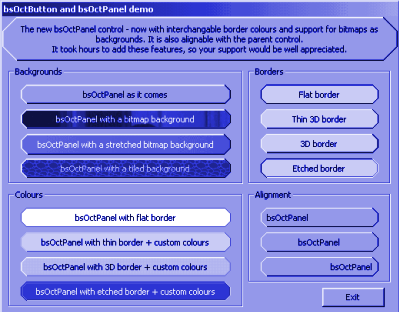



## bsOctControls v3

### Description

I've spent hours making this the most flexible 8-sided control in PSC today. You can now change the colour of the borders, have different border styles, use bitmaps for the backgrounds of the control and align the text to the left, right or middle. You can also align icons in the bsOctButton! Support for this control, as I have spent a while on it, would be greatly appreciated. A vote would be too.
 
### More Info
 

             |
---                |---
**Submitted On**   |2001-03-28 11:57:50
**By**             |[Headdy](https://github.com/Planet-Source-Code/PSCIndex/blob/master/ByAuthor/headdy.md)
**Level**          |Intermediate
**User Rating**    |4.8 (24 globes from 5 users)
**Compatibility**  |VB 5\.0
**Category**       |[Custom Controls/ Forms/  Menus](https://github.com/Planet-Source-Code/PSCIndex/blob/master/ByCategory/custom-controls-forms-menus__1-4.md)
**World**          |[Visual Basic](https://github.com/Planet-Source-Code/PSCIndex/blob/master/ByWorld/visual-basic.md)
**Archive File**   |[CODE\_UPLOAD176563282001\.zip](https://github.com/Planet-Source-Code/headdy-bsoctcontrols-v3__1-21985/archive/master.zip)

